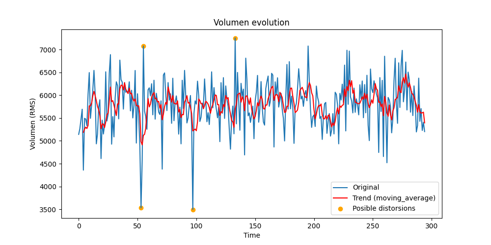

# AudioClassAnalysis


This project is designed to analyze audio files downloaded from various sources, extracting specific metrics and characteristics such as signal entropy, volume distortions, and intermediate silences.

## Description

The project aims to analyze audio files and extract various metrics that can be useful for studies or research on the quality and characteristics of audio. Some of the extracted metrics include:

- Signal entropy
- Low-frequency noise indicators
- Audio channel analysis (mono or stereo)
- Detection of intermediate silences
- Detection of volume distortions

Below, I describe each metric and process involved step by step, detailing the entire workflow from feature extraction to the final deployment of results.

## Metrics and Processes Description
### 1. Total Volume in RMS
The total volume in RMS is a measure of the average amplitude of the audio, used to determine if the audio is loud or quiet. Technically, the RMS (Root Mean Square) value of the audio is calculated, representing the square root of the mean of the squares of the amplitude samples. This provides a numerical indication of the audio volume level.

#### Process in the Code:
The `sound.rms` function from the pydub library is used to calculate the RMS of the audio.
The RMS values are stored in the `rms_s` list for each processed audio instance.

### 2. Total Audio Entropy
Total entropy is calculated to assess the complexity of the audio. In this context, Shannon entropy is used as a measure of uncertainty or variability in the amplitude distribution of audio samples. High entropy values indicate greater complexity or variability in the audio.

#### Process in the Code:
The `calculate_entropy(signal)` function is defined to calculate the Shannon entropy of the audio signal array.
A normalized histogram is used to calculate the amplitude distribution, and then the Shannon entropy formula is applied.

### 3. Average Percentage of Low Frequencies
The average percentage of low frequencies indicates what proportion of the audio corresponds to low frequencies, calculated as the average amplitude of the frequencies when the instructor is not speaking. This is used to determine the presence of background noise during silent moments.

#### Process in the Code:
The `ruidoIndicador_normalized(signal)` function is implemented to normalize the signal and filter low frequencies.
The average of the filtered amplitudes is calculated to obtain the average percentage of low frequencies.

### 4. Entropy of Low Frequencies
The entropy of low frequencies is calculated to assess the complexity of background noise in the low frequencies of the audio during silent moments. High entropy indicates greater variability or complexity in the background noise.

#### Process in the Code:
The Shannon entropy of the filtered low-frequency amplitudes is calculated using the `calculate_entropy(filtered_signal_desnorm)` function.

### 5. Channel Type (Mono, Stereo)
The channel type is determined for each audio, identifying whether it is monaural or stereo, and in the case of stereo, if it is primarily heard through the left or right channel. This helps identify the audio configuration used in the recordings.

#### Process in the Code:
The `analizar_canales(sound)` function is used to split the audio into channels and determine its type and configuration.
The presence and predominance of the signal in each channel (left or right) is evaluated.

### 6. Intermediate Silences
Intermediate silences are detected to identify moments when the instructor does not speak for at least 10 consecutive seconds. This is critical for identifying pauses or prolonged intervals of silence in the class recordings.

#### Process in the Code:
The `make_chunks(sound, chunk_length)` and `detectar_silenciosIntermedios(sound)` functions are used to split the audio into segments and detect periods of low volume that indicate prolonged silences.

### 7. Volume Distortions
Volume distortions are detected to identify outliers that are either very high or very low in the audio volume. This helps determine if there are segments where the volume is excessively high or low, which could affect the auditory quality.

#### Process in the Code:
The `detectar_distorsiones(sound)` function is used to apply a moving average and detect significant residues indicating volume distortions.
Moments where the volume deviates significantly from the calculated moving average are identified.

## Final Deployment
The final deployment of the analysis involves iterating over a list of URL codes that identify the audio files of each recorded class. For each audio instance:

* The audio file is loaded using `AudioSegment` from pydub.
* The mentioned metrics are extracted and calculated for each audio.
* The results are stored in corresponding lists (`rms_s`, `mae_lowFreq_list`, `signal_entropy_list`, etc.).
* Progress is tracked and displayed as a completion percentage.
* The final results are organized and presented in a structured format, possibly in a Pandas DataFrame, for further analysis.

This process not only evaluates the overall quality of the recorded class audios but also provides detailed insights into volume, audio complexity, background noise presence, and channel configuration, among other important aspects for assessing the quality of educational audio.

## Example usage

```python
import sys
import os
import matplotlib.pyplot as plt
# Añadir el directorio anterior al PYTHONPATH
script_path = os.path.abspath('../')
if script_path not in sys.path:
    sys.path.append(script_path)
from metricasCalidadAudio import *
audio_path = f"../../audios_de_trabajo/{'03JjCF4I'}.mp3" #### Directorio en donde estén los audios de las clases
sound = AudioSegment.from_mp3(audio_path)
signal = sound2signal(sound)
entropia_total = calculate_entropy(signal)
MAE, filtered_signal_desnorm = ruidoIndicador_normalized(signal)
signal_entropy = calculate_entropy(signal)
lowFrequencies_entropy =  calculate_entropy(filtered_signal_desnorm)
tipo_canal = analizar_canales(sound)
silenciosIntermedios = detectar_silenciosIntermedios(sound)
distorsiones = detectar_distorsiones(sound)
print('Volumen total :', sound.rms,
    '\nEntropía total:', entropia_total,
'\nPorcentaje medio de frecuencias bajas:', MAE*100,'%',
'\nEntropía de frecuencias bajas:', lowFrequencies_entropy,
'\nTipo de canal:', tipo_canal,
'\nSilencios intermedios:', silenciosIntermedios,
'\nDistorsiones:', distorsiones
)
chunk_length = 5000  #Buscamos de 5 en 5 segundos si hay volúmenes bajos
chunks = make_chunks(sound,chunk_length = chunk_length)
rms_s = [i.rms for i in chunks]
rms_s = rms_s[:-12] #Eliminar últimos 12 equivalentes a los últimos 60 segs
rms_s = rms_s[12:] # Eliminar primeros 12 equivalentes a los primeros 60 segs
window_size = int(chunk_length/1000)
moving_avg = moving_average(rms_s, window_size)
moving_avg_full = [None] * (window_size - 1) + moving_avg
residuos = [rms_s[i] - moving_avg_full[i] for i in range(len(rms_s)) if moving_avg_full[i] is not None]
mean_residuos = np.mean(residuos)
std_residuos = np.std(residuos)
outliers = [(i, rms_s[i]) for i in range(len(rms_s)) if moving_avg_full[i] is not None and abs(rms_s[i] - moving_avg_full[i]) > 3 * std_residuos]
plt.figure(figsize=(10, 5))
plt.plot(rms_s, label='Original')
plt.plot(moving_avg_full, label='Trend (moving_average)', color='red')
plt.scatter(*zip(*outliers), color='orange', label='Posible distorsions')
plt.title('Volumen evolution')
plt.ylabel('Volumen (RMS)')
plt.xlabel('Time')
plt.legend()
plt.show()
```
```
Volumen total : 5735 
Entropía total: 1.3959036589004608 
Porcentaje medio de frecuencias bajas: 7.679755915897861 % 
Entropía de frecuencias bajas: 1.3959036589004608 
Tipo de canal: Estéreo sólo izquierdo 
Silencios intermedios: [] 
Distorsiones: [4.416666666666667, 4.583333333333333, 8.083333333333334, 11.083333333333334]
```



